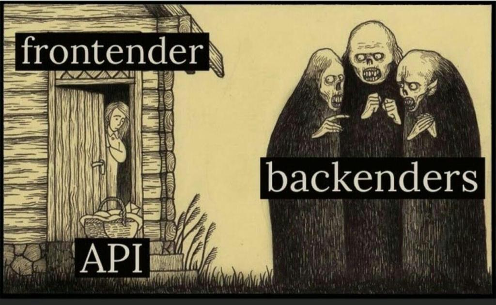
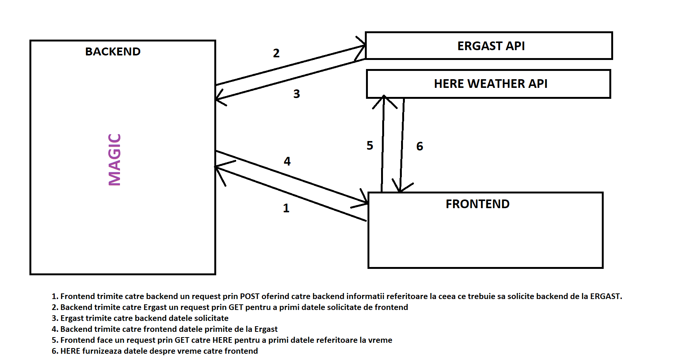
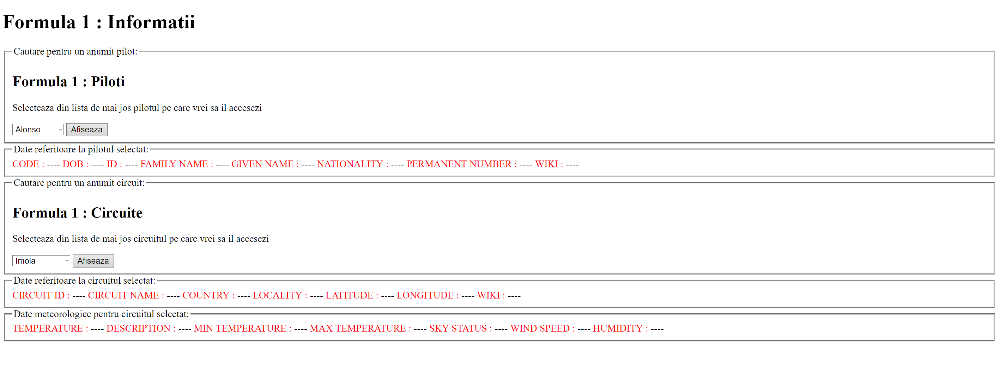
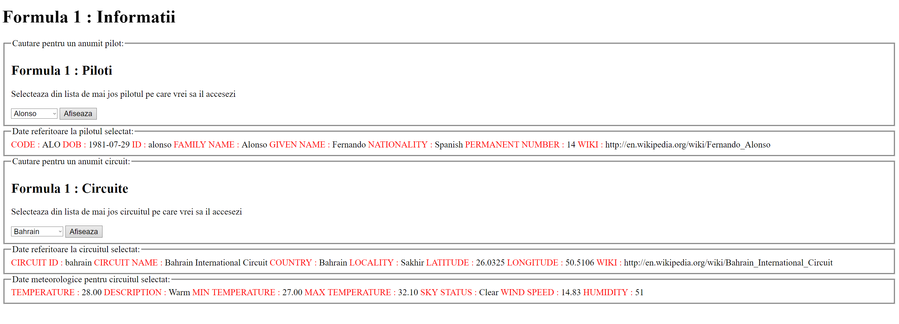

DOCUMENTATIE : 
         ___        ______     ____ _                 _  ___  
        / \ \      / / ___|   / ___| | ___  _   _  __| |/ _ \ 
       / _ \ \ /\ / /\___ \  | |   | |/ _ \| | | |/ _` | (_) |
      / ___ \ V  V /  ___) | | |___| | (_) | |_| | (_| |\__, |
     /_/   \_\_/\_/  |____/   \____|_|\___/ \__,_|\__,_|  /_/ 
 ----------------------------------------------------------------- 
 
 

INTRODUCERE :
Pentru realizarea proiectului am cautat o tema destul de familiara, aceea fiind Formula1.

DESCRIERE PROBLEMA :
In ceea ce priveste aplicatia, problema pe care am incercat sa o rezolv este referitoare la modul in care utilizatorul ar putea sa obtina date despre piloti sau despre circuite intr-un mod rapid fara a mai fi nevoie de a face query pe baza de date.
Mai mult, ideea de a oferi date despre un anumit circuit de F1 m-a dus cu gandul la faptul ca cel care acceseaza aceste informatii probabil si-ar dori sa mearga si sa-l viziteze. Asadar am cautat o optiune de a integra si date despre vremea din zona respectiva in momentul accesarii.

DESCRIERE API :
Pentru datele despre F1 am ales sa folosesc API-ul de la Ergast ( http://ergast.com/mrd/ ) deoarece acesta ofera o colectie vasta de inregistrari ce includ date despre sezoanele F1, rezultate de la calificari, informatii despre constructori, timpi, informatii despre circuite, date de la pit stop, rezultate si multe altele. Formatul pe care il primesc de la API va fi JSON.
API-ul pentru vreme ( https://developer.here.com ) are nevoie de o cheie de securitate. Pentru aceasta este necesar un cont. Requestul catre API se face in functie de latitudine si longitudine ( pe care le preiau din informatiile despre circuit ).

FLUX DE DATE :
De pe FRONTEND se va face un request catre BACKEND folosing XMLHttpRequest. Se va seta tipul de data ce trebuie returnat ca fiind de format JSON pentru o parsare usoara. In momentul in care readyState = 4 (done) se va parsa JSON-ul primit pentru a folosi datele pe front end. Modul in care fac Request este de tip POST deoarece voi apela un endpoint ce va primi date in request.body. 
In backend, pe endpoint-ul respectiv se va realiza un request catre api in functie de ceea ce se primeste in request.body. Ulterior serverul va intoarce catre client JSON-ul rezultat in requestul pe care backend-ul il realizeaza catre API.
Backend-ul face request de tip GET deoarece nu are nevoie sa trimia date catre API. Requestul se va face pe baza unui link construit in functie de specificatiile provider-ului de API.

Pentru utilizarea API-ului de vreme este nevoie de o cheie ce se va pune in JQuery. Cheia respectiva se poate obtine prin autentificarea pe site-ul ce furnizeaza API.

CAPTURI DE ECRAN :

Aici se poate observa aplicatia in forma default fara request trimis.

Aici este aplicatia dupa ce s-a trimis request pentru pilot si circuit.